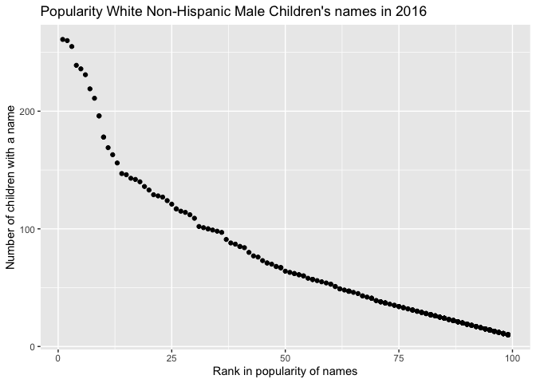

p8105\_hw2\_hw2849
================
hw2849
2021.10.04

``` r
library(tidyverse)
```

    ## ── Attaching packages ─────────────────────────────────────── tidyverse 1.3.1 ──

    ## ✓ ggplot2 3.3.5     ✓ purrr   0.3.4
    ## ✓ tibble  3.1.4     ✓ dplyr   1.0.7
    ## ✓ tidyr   1.1.3     ✓ stringr 1.4.0
    ## ✓ readr   2.0.1     ✓ forcats 0.5.1

    ## ── Conflicts ────────────────────────────────────────── tidyverse_conflicts() ──
    ## x dplyr::filter() masks stats::filter()
    ## x dplyr::lag()    masks stats::lag()

``` r
library(readxl)
library(dplyr)
```

## Problem 1

Use excel `Mr. Trash Wheel` dataset

``` r
litter_data = read_excel("./data/Trash-Wheel-Collection-Totals-7-2021-sept.xlsx", sheet = 1) %>%
  janitor::clean_names() %>%
  drop_na(dumpster) %>%
  mutate(
    sports_balls = round(sports_balls, 0)
         )
```

    ## New names:
    ## * `` -> ...15
    ## * `` -> ...16
    ## * `` -> ...17

``` r
litter_data
```

    ## # A tibble: 488 × 17
    ##    dumpster month  year date                weight_tons volume_cubic_yards
    ##    <chr>    <chr> <dbl> <dttm>                    <dbl>              <dbl>
    ##  1 1.0      May    2014 2014-05-16 00:00:00        4.31                 18
    ##  2 2.0      May    2014 2014-05-16 00:00:00        2.74                 13
    ##  3 3.0      May    2014 2014-05-16 00:00:00        3.45                 15
    ##  4 4.0      May    2014 2014-05-17 00:00:00        3.1                  15
    ##  5 5.0      May    2014 2014-05-17 00:00:00        4.06                 18
    ##  6 6.0      May    2014 2014-05-20 00:00:00        2.71                 13
    ##  7 7.0      May    2014 2014-05-21 00:00:00        1.91                  8
    ##  8 8.0      May    2014 2014-05-28 00:00:00        3.7                  16
    ##  9 9.0      June   2014 2014-06-05 00:00:00        2.52                 14
    ## 10 10.0     June   2014 2014-06-11 00:00:00        3.76                 18
    ## # … with 478 more rows, and 11 more variables: plastic_bottles <dbl>,
    ## #   polystyrene <dbl>, cigarette_butts <dbl>, glass_bottles <dbl>,
    ## #   grocery_bags <dbl>, chip_bags <dbl>, sports_balls <dbl>,
    ## #   homes_powered <dbl>, x15 <chr>, x16 <lgl>, x17 <lgl>

Clean precipitation data for 2019.

``` r
prep_2019 = read_excel("./data/Trash-Wheel-Collection-Totals-7-2021-sept.xlsx", sheet = 7, "A2:B14") %>%
  janitor::clean_names() %>%
  drop_na() %>% 
  mutate(
    year = 2019, month = month.name[as.numeric(month)]
) 
```

Clean precipitation data for 2018.

``` r
prep_2018 = read_excel("./data/Trash-Wheel-Collection-Totals-7-2021-sept.xlsx", sheet = 8, "A2:B14") %>% 
   janitor::clean_names() %>%
   drop_na() %>% 
  mutate(
    year = 2018, month = month.name[as.numeric(month)]
) 
```

Combine two datasets

``` r
combine_data = full_join(prep_2018, prep_2019)
```

    ## Joining, by = c("month", "total", "year")

Find the total Precipitation in 2018.

``` r
combine_data %>% 
filter(year == "2018") %>% 
  pull(total) %>% 
  sum()
```

    ## [1] 70.33

Find the median number of sports balls in a dumpster in 2019

``` r
filter(litter_data, year == "2019") %>% 
  pull(sports_balls) %>% 
  median()
```

    ## [1] 9

`litter_data` dataset contains 344 observations and 17 variables,
including years, months, dates, and different kinds of trash such as
sports balls. Cleaned precipitation data for 2018 has 12 observations pf
3 variables, while for 2019 is 6 observations and 3 variables. The
combined table has 18 observations of 3 variables in total. The total
precipitation in 2018 was 70.33, and the median number of sports balls
in a dumpster in 2019 was 9.

## Problem 2

Let’s tidy `pols-month.csv`.

``` r
pols_month = read_csv("./data/fivethirtyeight_datasets/pols-month.csv") %>% 
  
## separate `mon` into `ymd` and convert month to character
  separate(mon, c("year", "month", "day")) %>% 
  mutate(
    month = month.name[as.numeric(month)], 
  ) %>% 
  
## create a president variable with values of gop and dem
  pivot_longer(
    prez_gop | prez_dem,
    names_to = "president",
    names_prefix = "prez_",
    values_to = "gop_dem"
  ) %>% 
  filter(gop_dem != 0) %>% 
  
## get rid of the column of day and prez_gop and prez_dem
 select(-day, -gop_dem)
```

    ## Rows: 822 Columns: 9

    ## ── Column specification ────────────────────────────────────────────────────────
    ## Delimiter: ","
    ## dbl  (8): prez_gop, gov_gop, sen_gop, rep_gop, prez_dem, gov_dem, sen_dem, r...
    ## date (1): mon

    ## 
    ## ℹ Use `spec()` to retrieve the full column specification for this data.
    ## ℹ Specify the column types or set `show_col_types = FALSE` to quiet this message.

clean the data in `snp.csv`

``` r
snp_df = read_csv("./data/fivethirtyeight_datasets/snp.csv") %>% 
  
## Separate `date` into `ymd`
  mutate(
    date = lubridate::mdy(date)
  ) %>% 
  
## Convert month to character and make year varibale true to the reality
  separate(date, c("year", "month", "day")) %>% 
  mutate(
    month = month.name[as.numeric(month)],
    year = as.numeric(year),
     year = ifelse(year > 2021, year - 100, year)
  ) %>% 
  mutate(year = as.character(year)) %>% 

## remove the day variable
  select(-day)
```

    ## Rows: 787 Columns: 2

    ## ── Column specification ────────────────────────────────────────────────────────
    ## Delimiter: ","
    ## chr (1): date
    ## dbl (1): close

    ## 
    ## ℹ Use `spec()` to retrieve the full column specification for this data.
    ## ℹ Specify the column types or set `show_col_types = FALSE` to quiet this message.

Tidy the unemployment data

``` r
unemployment = read_csv("./data/fivethirtyeight_datasets/unemployment.csv") %>% 
  rename(year = Year) %>% 
  
## organize this data with pivot_longer
  pivot_longer(
    Jan:Dec,
    names_to = "month",
    values_to = "unemployment"
    ) %>% 
  mutate(year = as.character(year))
```

    ## Rows: 68 Columns: 13

    ## ── Column specification ────────────────────────────────────────────────────────
    ## Delimiter: ","
    ## dbl (13): Year, Jan, Feb, Mar, Apr, May, Jun, Jul, Aug, Sep, Oct, Nov, Dec

    ## 
    ## ℹ Use `spec()` to retrieve the full column specification for this data.
    ## ℹ Specify the column types or set `show_col_types = FALSE` to quiet this message.

Join the datasets by merging `snp` into `pols`, and merging
`unemployment` into the result.

``` r
## join snp_df into pols_month table with left_join function
snp_into_pols = left_join(pols_month, snp_df)
```

    ## Joining, by = c("year", "month")

``` r
## merging unemployment into the table above 
results = left_join(snp_into_pols, unemployment)
```

    ## Joining, by = c("year", "month")

## Problem 3

Let’s tidy the dataset of NYC popularity of baby names.

``` r
baby_name = read_csv("./data/Popular_Baby_Names.csv") %>% 
  janitor::clean_names() %>%
  
## remove duplicated rows
  distinct() %>% 
  
## solve case structure of string variables (child's name)
  mutate(
    childs_first_name = str_to_sentence(childs_first_name)
  )
```

    ## Rows: 19418 Columns: 6

    ## ── Column specification ────────────────────────────────────────────────────────
    ## Delimiter: ","
    ## chr (3): Gender, Ethnicity, Child's First Name
    ## dbl (3): Year of Birth, Count, Rank

    ## 
    ## ℹ Use `spec()` to retrieve the full column specification for this data.
    ## ℹ Specify the column types or set `show_col_types = FALSE` to quiet this message.

``` r
## creating a table showing the rank in popularity of Olivia(female) over time
olivia_df = filter(baby_name, gender == "FEMALE", childs_first_name == "Olivia")

## creating a table for most popular male name over time
most_popular_male_name = filter(baby_name, gender == "MALE", rank == "1")

baby_name %>% 
  filter(
    gender == "MALE", 
    year_of_birth == "2016", 
    ethnicity == "WHITE NON HISPANIC"
    ) %>% 
  ggplot(aes(x = rank, y = count)) + 
  geom_point() + 
  labs(
    title = "Popularity White Non-Hispanic Male Children's names in 2016",
       x = "Rank in popularity of names",
       y = "Number of children with a name"
)
```

<!-- -->
